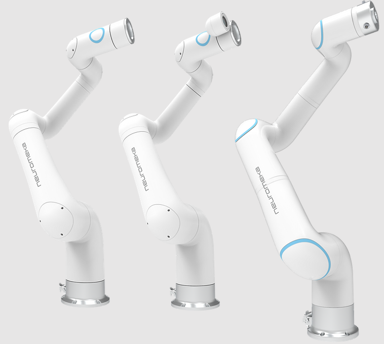

# Indy ROS2

## Introduction

**Indy** is Neuromeka’s flagship cobot model we designed and manufactured. Guaranteeing workers’ safety based on innovative collision detection algorithms, Indy supports more intuitive direct teaching by impedance control as well as online and offline programming with the teach pendant app running on android tablets.

<center></center> 


This repository contains ROS2 drivers for Indy7, Indy7V2, IndyRP2, IndyRP2V2 and Indy12.


## Preparation

The following software needs to be installed:
- [ROS2 foxy](https://docs.ros.org/en/foxy/Installation.html)


## Installation

### Install dependencies

```
sudo apt install python3-rosdep
sudo apt install python3-rosdep2
sudo rosdep init
rosdep update
sudo apt update
sudo apt install rospack-tools
sudo apt install python3-colcon-common-extensions
sudo apt install python3-colcon-mixin
colcon mixin add default https://raw.githubusercontent.com/colcon/colcon-mixin-repository/master/index.yaml
colcon mixin update default
sudo apt install python3-vcstool

sudo apt install -y ros-foxy-xacro \
ros-foxy-moveit \
ros-foxy-moveit-servo \
ros-foxy-ros2-control \
ros-foxy-ros2-controllers \
ros-foxy-moveit-ros-move-group \
ros-foxy-moveit-planners-ompl \
ros-foxy-moveit-kinematics \
ros-foxy-gazebo-ros \
ros-foxy-gazebo-ros2-control \
ros-foxy-controller-manager \
ros-foxy-joint-state-broadcaster \
ros-foxy-joint-state-publisher-gui \
ros-foxy-joint-trajectory-controller \
ros-foxy-moveit-ros-perception \
ros-foxy-rviz-visual-tools \
ros-foxy-moveit-resources

sudo pip3 install numpy scipy
```

Switch to Cyclone DDS
sudo apt install ros-foxy-rmw-cyclonedds-cpp


#### Add this to ~/.bashrc to source it automatically

export RMW_IMPLEMENTATION=rmw_cyclonedds_cpp


### Create a workspace and download the source code

```
cd ~
mkdir -p indy_ros2/src
cd ~/indy_ros2/src
git clone <this repository url>
```

### Build the package

```
cd ~/indy_ros2/
colcon build
```

### Source the setup file
```
source /opt/ros/foxy/setup.bash
source ~/indy_ros2/install/setup.bash
```

## Usage

Use **indy_type** to choose specific robot **(indy7, indy7_v2, indy12, indyrp2, indyrp2_v2)**.
Use **indy_eye** to enable Indy Eye model **(support indy7, indyrp2)**. 
To enable Indy Eye, add **indy_eye:=true** to the end of command

If not specified, the default value will be indy7.

When used with a real robot, you need to provide an **indy_ip** value.

### Indy GRPC Client

Indy gRPC Client will run on a real robot and create communication with ROS PC.
To use Indy gRPC Client, we need to install gRPC on the computer that installed ROS:

```
sudo pip3 install --upgrade --force-reinstall protobuf==3.19.4 grpcio==1.34.1 grpcio_tools==1.34.1
```

Find TeleoperationTask and TeleopRecordingTask for your version of Indy from TasksDeployment folder.
Connect to the Indy CB and copy above files to /home/user/release/TasksDeployment:

* Add following lines to QueueHigh dictionary 
```json
{
    "TaskName" : "IndyTeleopRecordingTask",
    "SharedLib" : "libIndyTeleopRecordingTask.so",
    "Location" : "/home/user/release/TasksDeployment/"
}
```

* Add following lines to QueueMedium dictionary. Check the medium loop frequency:```"MediumRate" : 500, /*Hz*/``` 
```json
{
    "TaskName" : "Indy7TeleoperationTask",
    "SharedLib" : "libIndy7TeleoperationTask.so",
    "Location" : "/home/user/release/TasksDeployment/"
}
```

### Using Sigma

**Install Sigma**

For 64bit

```
wget https://www.forcedimension.com/downloads/sdk/sdk-3.15.0-linux-x86_64-gcc.tar.gz
tar -xzvf sdk-3.15.0-linux-x86_64-gcc.tar.gz
```

For 32bit

```
wget https://www.forcedimension.com/downloads/sdk/sdk-3.15.0-linux-i686-gcc.tar.gz
tar -xzvf sdk-3.15.0-linux-i686-gcc.tar.gz
```

check ld -ldhd --verbos / ld -ldrd --verbos
copy libdhd.a, libdrd.a to library folder
(32bit and 64bit version will show different library directory)

Example for 64bit version

```
sudo mkdir -p /usr/local/lib/x86_64-linux-gnu
cd /sdk-3.15.0/lib/release/lin-x86_64-gcc
sudo cp libdhd.a /usr/local/lib/x86_64-linux-gnu/libdhd.a
sudo cp libdrd.a /usr/local/lib/x86_64-linux-gnu/libdrd.a
```

Config UDEV

```
sudo nano /etc/udev/rules.d/sigma.rules
```
copy ATTRS{idProduct}=="0403", ATTRS{idVendor}=="1451",MODE="666",GROUP="plugdev"
```
sudo udevadm trigger
```


### Start Indy Robot

Launch indy_driver with one of following config files: *1robot_config.yaml*, *2robot_config.yaml*, *4robot_config.yaml* 

```
ros2 launch indy_driver indy_bringup.launch.py config_file:=1robot_config.yaml
```

#### Use with Sigma7

Start the keyboard control, because the sigma doesn't have button, so we will use keyboard to start stop telemode, switch robot, record and play functions. Only need one keyboard node for 4 robots.

```
ros2 run indy_driver indy_keyboard.py
```

Launch sigma node
```bash
ros2 launch sigma sigma.launch.py
```

The default sigma node will load ```config0:=sigma0.yaml``` control 2 robots (robot0, robot1).
To run two sigmas, add ```config1:=sigma1.yaml```
```
ros2 launch indy_driver indy_sigma_bringup.launch.py
```

### Start Indy with Moveit

Example for one robot start.
```
ros2 launch indy_moveit indy_moveit_real_robot.launch.py config_file:=1robot_config.yaml
```

#### [DEPRECATED] Use with xbox gamepad

```
ros2 run joy joy_node
ros2 run indy_driver indy_xbox.py
```
