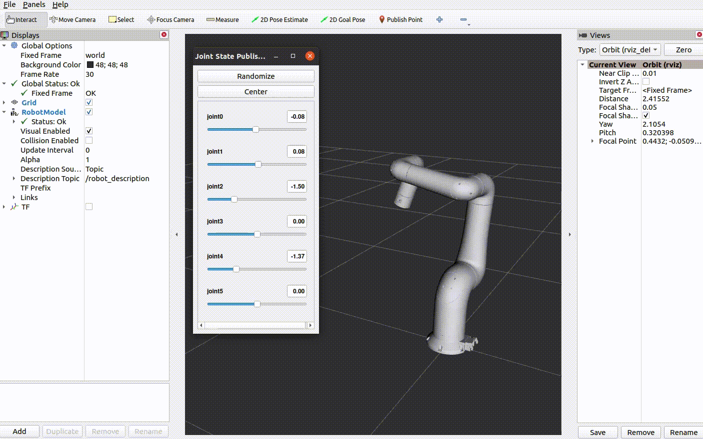

# Indy ROS2

## Introduction

**Indy** is Neuromeka’s flagship cobot model we designed and manufactured. Guaranteeing workers’ safety based on innovative collision detection algorithms, Indy supports more intuitive direct teaching by impedance control as well as online and offline programming with the teach pendant app running on android tablets.

<center></center> 


This repository contains ROS2 drivers for Indy7, Indy7V2, IndyRP2, IndyRP2V2 and Indy12.


## Preparation

The following software needs to be installed:
- [ROS2 foxy](https://docs.ros.org/en/foxy/Installation.html)


## Installation

### Install dependencies

```
sudo apt install python3-rosdep
sudo apt install python3-rosdep2
sudo rosdep init
rosdep update
sudo apt update
sudo apt install rospack-tools
sudo apt install python3-colcon-common-extensions
sudo apt install python3-colcon-mixin
colcon mixin add default https://raw.githubusercontent.com/colcon/colcon-mixin-repository/master/index.yaml
colcon mixin update default
sudo apt install python3-vcstool

sudo apt install -y ros-foxy-xacro \
ros-foxy-moveit \
ros-foxy-moveit-servo \
ros-foxy-ros2-control \
ros-foxy-ros2-controllers \
ros-foxy-moveit-ros-move-group \
ros-foxy-moveit-planners-ompl \
ros-foxy-moveit-kinematics \
ros-foxy-gazebo-ros \
ros-foxy-gazebo-ros2-control \
ros-foxy-controller-manager \
ros-foxy-joint-state-broadcaster \
ros-foxy-joint-state-publisher-gui \
ros-foxy-joint-trajectory-controller \
ros-foxy-moveit-ros-perception \
ros-foxy-rviz-visual-tools \
ros-foxy-moveit-resources
```


Switch to Cyclone DDS
sudo apt install ros-foxy-rmw-cyclonedds-cpp


#### Add this to ~/.bashrc to source it automatically

export RMW_IMPLEMENTATION=rmw_cyclonedds_cpp


### Create a workspace and download the source code

```
cd ~
mkdir -p indy_ros2/src
cd ~/indy_ros2/src
git clone <this repository url>
```

### Build Indy driver

```
cd ~/indy_ros2/
colcon build
```

### Source the setup file
```
. install/setup.bash
```

## Usage

Use **indy_type** to choose specific robot **(indy7, indy7_v2, indy12, indyrp2, indyrp2_v2)**.
Use **indy_eye** to enable Indy Eye model **(support indy7, indyrp2)**. 
To enable Indy Eye, add **indy_eye:=true** to the end of command

If not specified, the default value will be indy7.

When used with a real robot, you need to provide an **indy_ip** value.

**In servoing mode:**
Using Dpad to control joint 2 and joint 4.
B and X control joint 6
Y and A control joint 5
Left joystick, right joystick, LB, RB, LT, RT to control TCP.

### Start Indy description

```
ros2 launch indy_description indy_display.launch.py indy_type:=indy7
```




### Simulation Robot

#### Start Indy Gazebo Robot

```
ros2 launch indy_gazebo indy_gazebo.launch.py indy_type:=indy7
```

#### Start Indy Gazebo with Moveit and Servoing

If use moveit 

```
ros2 launch indy_moveit indy_moveit_gazebo.launch.py indy_type:=indy7
```

If use servoing 

```
ros2 launch indy_moveit indy_moveit_gazebo.launch.py indy_type:=indy7 servo_mode:=true
```


### Real Robot

#### Start Indy Robot

```
ros2 launch indy_driver indy_bringup.launch.py indy_type:=indy7 indy_ip:=192.168.xxx.xxx
```

#### Start Indy with Moveit

If use moveit 

```
ros2 launch indy_moveit indy_moveit_real_robot.launch.py indy_type:=indy7 indy_ip:=192.168.xxx.xxx
```

If use servoing - NOTE: CANNOT USE SERVOING MODE ON REAL ROBOT IN THIS VERSION
```
ros2 launch indy_moveit indy_moveit_real_robot.launch.py indy_type:=indy7 indy_ip:=192.168.xxx.xxx servo_mode:=true
```
