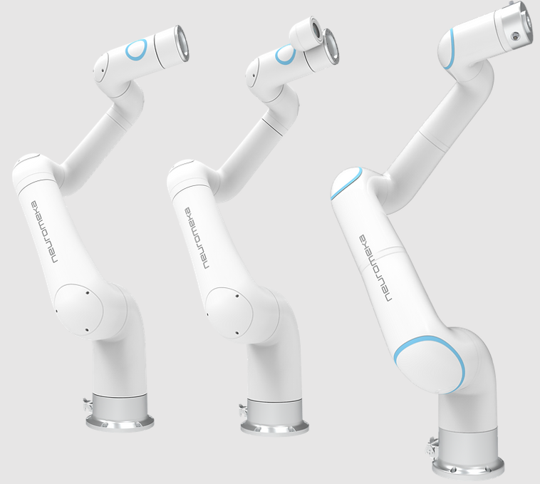
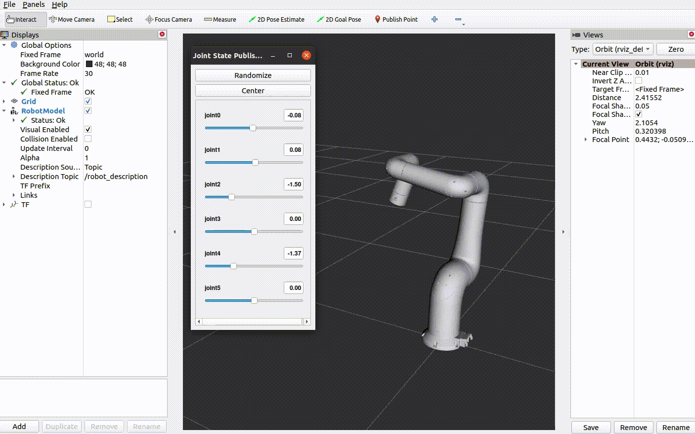

# Indy ROS2

## Introduction

**Indy** is Neuromeka's flagship cobot model we designed and manufactured.
Guaranteeing workers' safety based on innovative collision detection algorithms,
Indy supports more intuitive direct teaching by impedance control as well as
online and offline programming with the teach pendant app running on Android
tablets.



This repository contains ROS2 drivers for Indy7, Indy7V2, IndyRP2, IndyRP2V2,
Indy12, Indy12V2, and additional Neuromeka robot descriptions.

## Preparation

The following software needs to be installed:

- [ROS2 Humble](https://docs.ros.org/en/humble/Installation.html)
- [Neuromeka Package](https://github.com/neuromeka-robotics/neuromeka-package)

```bash
pip3 install neuromeka
pip3 install --upgrade neuromeka
```

## Installation

### Install Dependencies

```bash
sudo apt install python3-rosdep
sudo apt install python3-rosdep2
sudo rosdep init
rosdep update
sudo apt update
sudo apt install rospack-tools
sudo apt install python3-colcon-common-extensions
sudo apt install python3-colcon-mixin
colcon mixin add default https://raw.githubusercontent.com/colcon/colcon-mixin-repository/master/index.yaml
colcon mixin update default
sudo apt install python3-vcstool

sudo apt install -y ros-humble-xacro \
ros-humble-moveit \
ros-humble-moveit-servo \
ros-humble-ros2-control \
ros-humble-ros2-controllers \
ros-humble-moveit-ros-move-group \
ros-humble-moveit-planners-ompl \
ros-humble-moveit-kinematics \
ros-humble-gazebo-ros \
ros-humble-gazebo-ros2-control \
ros-humble-controller-manager \
ros-humble-joint-state-broadcaster \
ros-humble-joint-state-publisher-gui \
ros-humble-joint-trajectory-controller \
ros-humble-moveit-ros-perception \
ros-humble-rviz-visual-tools \
ros-humble-moveit-visual-tools \
ros-humble-moveit-resources
```

### Switch To Cyclone DDS

```bash
sudo apt install ros-humble-rmw-cyclonedds-cpp
```

Add this to `~/.bashrc` to source it automatically:

```bash
export RMW_IMPLEMENTATION=rmw_cyclonedds_cpp
```

### Create Workspace

Create workspace and download the source code

```bash
cd
mkdir -p indy-ros2/src
cd ~/indy-ros2/src
git clone <this repository url>
```

Build the source code

```bash
cd ~/indy-ros2/
colcon build
```

### Source The Setup File

```bash
. install/setup.bash
```

## Usage

Use **indy_type** to choose the robot model.

Supported **indy_type** values:

```text
indy7, indy7_v2, indy7_v3, indy12, indy12_v2, indy12_v3,
indyrp2, indyrp2_v2, icon7l, icon3,
nuri3s, nuri4s, nuri5s, nuri5sdual, nuri7c, nuri12c, nuri20c, nuri30,
opti5, opti3, eir
```

`nuri5sdual` supports description display and MoveIt/Gazebo simulation. Real
robot bringup requires a dedicated dual-arm hardware interface.

`nuri5s` is a compatibility alias for `nuri4s`; both names use the same NURI4s
kinematics, physical parameters, limits, and meshes. Each arm in `nuri5sdual`
uses that same NURI4s model.

Use **indy_eye** to enable the Indy Eye model.

Supported **indy_eye** values:

```text
indy7, indy7_v2, indy7_v3, indy12_v3, indyrp2, indyrp2_v2
```

To enable Indy Eye, add **indy_eye:=true** to the end of command.

Use **gripper_dh_ag95** to attach DH_AG95 grippers to EIR in the robot
description.

```bash
ros2 launch indy_description indy_display.launch.py indy_type:=eir gripper_dh_ag95:=true
```

EIR support in this Humble branch is currently limited to robot description and
URDF generation.

If not specified, the default value will be indy7.

When used with a real robot, you need to provide an **indy_ip** value.

### Servoing Mode With Joy Controller

Tested with XBOX ONE S gamepad.

- Use Dpad to control joint 1 and joint 2.
- B and X control joint 4.
- Y and A control joint 3.
- Left joystick, right joystick, LB, RB, LT, and RT control TCP.

#### Joy Controller On Real Robot

- Use `LEFT_STICK_CLICK` to move Home.
- Use `RIGHT_STICK_CLICK` to move Zero.
- Use `XBOX` to Recover.
- Use `HOME` to Start/Stop Teleop.

### Servoing Mode With Keyboard

#### Keyboard Common Use

- Use arrow keys and the `.` and `;` keys to Cartesian jog.
- Use `W` to Cartesian jog in the world frame, and `E` for the End-Effector frame.
- Use `N`, `M`, and `,` for the Task move UVW.
- Use `1|2|3|4|5|6|7` keys to joint jog. `R` reverses the jogging direction.
- Use `-` and `+` to adjust joint speed.
- Use `9` and `0` to adjust task speed.
- Use `Q` to quit.

#### Keyboard On Real Robot

- Use `H` to move Home.
- Use `Z` to move Zero.
- Use `S` to Recover.
- Use `P` to stop Teleop.

### Generate URDF Files

You can generate URDF files using `generate_all_urdfs.sh` in the
`indy_description/urdf` folder.

```bash
cd <path-to-indy_description>/urdf
chmod +x generate_all_urdfs.sh
./generate_all_urdfs.sh
```

### Start Indy Description

```bash
ros2 launch indy_description indy_display.launch.py indy_type:=indy7
```



### Simulation Robot

#### Start Indy Robot In Simulation

```bash
ros2 launch indy_gazebo indy_gazebo.launch.py indy_type:=indy7
```

#### Start MoveIt In Simulation

```bash
ros2 launch indy_moveit indy_moveit_gazebo.launch.py indy_type:=indy7
```

#### Start Servoing In Simulation

```bash
ros2 launch indy_moveit indy_moveit_gazebo.launch.py indy_type:=indy7 servo_mode:=true
```

Start keyboard or controller:

```bash
ros2 run indy_driver servo_keyboard_input.py --ros-args -p is_sim:=true
```

```bash
ros2 run indy_driver servo_joy_input.py --ros-args -p is_sim:=true
```

### Real Robot

#### Start Real Robot

```bash
ros2 launch indy_driver indy_bringup.launch.py indy_type:=indy7 indy_ip:=192.168.xxx.xxx
```

#### Start MoveIt With Real Robot

```bash
ros2 launch indy_moveit indy_moveit_real_robot.launch.py indy_type:=indy7 indy_ip:=192.168.xxx.xxx
```

#### Start Servoing With Real Robot

```bash
ros2 launch indy_moveit indy_moveit_real_robot.launch.py indy_type:=indy7 indy_ip:=192.168.xxx.xxx servo_mode:=true
```

Start keyboard or controller:

```bash
ros2 run indy_driver servo_keyboard_input.py --ros-args -p is_sim:=false
```

```bash
ros2 run indy_driver servo_joy_input.py --ros-args -p is_sim:=false
```

## Docker Setup Instructions For ROS2 Humble

### Install Docker

If Docker is not installed on your system, follow these steps:

```bash
sudo apt update \
&& sudo apt install -y docker.io \
&& sudo systemctl start docker \
&& sudo systemctl enable docker
```

Navigate to the Dockerfile directory:

```bash
cd ~/indy-ros2/docker
```

Build the Docker image:

```bash
sudo docker build -t ros2_humble_neuromeka:humble-indyDCP3 .
```

Verify the Docker image:

```bash
sudo docker images
```

Prepare for GUI applications such as RViz and Gazebo:

```bash
xhost +local:docker
```

Create and start a Docker container named `ros2_humble_neuromeka_container`
with GUI support:

```bash
sudo docker run -it --name \
ros2_humble_neuromeka_container \
-e DISPLAY=$DISPLAY \
-v /tmp/.X11-unix:/tmp/.X11-unix \
ros2_humble_neuromeka:humble-indyDCP3
```

Access the Docker container in another terminal:

```bash
sudo docker exec -it ros2_humble_neuromeka_container bash
```

Your Docker environment is now configured.
